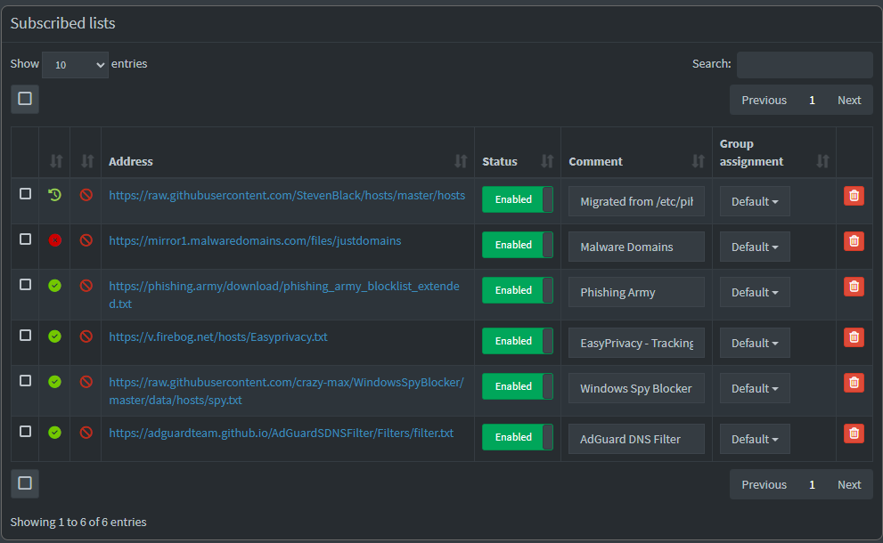
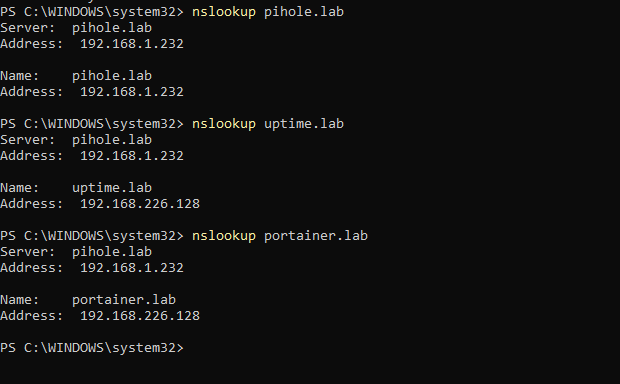

# Project 2: Network-Wide Ad Blocking with Pi-hole


## 📋 Project Overview

Deployed a containerized Pi-hole DNS server to provide network-wide ad blocking, malicious domain filtering, and DNS query analytics. This project demonstrates advanced Docker networking, DNS protocol understanding, and security-focused infrastructure design with dedicated service isolation.

## 🎯 Learning Objectives

- Build Ubuntu Server from scratch with proper configuration
- Deploy and manage Docker containers with complex networking
- Understand DNS protocol and query types (A, AAAA, PTR)
- Configure network-wide security through DNS filtering
- Troubleshoot networking issues (NAT vs Bridged, port conflicts)
- Implement persistent data storage with Docker volumes
- Analyze DNS query logs for security insights

## 🛠️ Technologies Used

| Technology | Version | Purpose |
|------------|---------|---------|
| Ubuntu Server | 24.04 LTS | Host OS |
| Docker | 28.2.2 | Container runtime |
| Pi-hole | v6.3 | DNS server & ad blocker |
| VMware Workstation | Pro 25H2 | Virtualization platform |
| dnsmasq | (included) | DNS & DHCP services |

## 🏗️ Architecture
```
┌─────────────────────────────────────────┐
│          Windows 11 Host                │
│  (Intel 14th Gen, 32GB RAM)             │
│                                         │
│  ┌───────────────────────────────────┐ │
│  │   VMware Workstation Pro          │ │
│  │                                   │ │
│  │  ┌─────────────────────────────┐ │ │
│  │  │  Pi-hole-Server             │ │ │
│  │  │  Ubuntu Server 24.04        │ │ │
│  │  │  (2GB RAM, 2 vCPU, 20GB)    │ │ │
│  │  │                             │ │ │
│  │  │  ┌──────────────────────┐   │ │ │
│  │  │  │  Docker Engine       │   │ │ │
│  │  │  │                      │   │ │ │
│  │  │  │  ┌────────────────┐  │   │ │ │
│  │  │  │  │   Pi-hole      │  │   │ │ │
│  │  │  │  │   DNS: 53      │  │   │ │ │
│  │  │  │  │   Web: 8080    │  │   │ │ │
│  │  │  │  │   Blocklists:  │  │   │ │ │
│  │  │  │  │   387,068       │  │   │ │ │
│  │  │  │  └────────────────┘  │   │ │ │
│  │  │  └──────────────────────┘   │ │ │
│  │  │                             │ │ │
│  │  │  IP: 192.168.1.232          │ │ │
│  │  │  Network: Bridged           │ │ │
│  │  └─────────────────────────────┘ │ │
│  └───────────────────────────────────┘ │
│                                         │
│  Windows DNS: 192.168.1.232 (Pi-hole)  │
└─────────────────────────────────────────┘
          ↓ DNS Queries
┌─────────────────────────────────────────┐
│         Home Network                    │
│  Router, IoT devices, etc.              │
└─────────────────────────────────────────┘
```

## 📸 Screenshots

### Pi-hole Dashboard (Initial Deployment)

*Initial deployment showing 117 total queries, 68,449 domains on default blocklists*

### Pi-hole Dashboard (Enhanced)

*After enhancement: 387,068 domains across 6 threat intelligence feeds*

### Blocklist Configuration

*Six threat intelligence feeds enabled: Steven Black, Malware Domains, Phishing Army, EasyPrivacy, Windows Spy Blocker, AdGuard*

### Local DNS Configuration

*Custom DNS records working: pihole.lab, uptime.lab, portainer.lab resolving correctly*

### Query Log - DNS Activity

*Real-time DNS query logging showing A, AAAA, and PTR record requests*

### Windows DNS Configuration

*Windows configured to use Pi-hole (192.168.1.232) as primary DNS*

### DNS Resolution Test

*PowerShell confirmation showing successful DNS queries through Pi-hole*
```

---

# 🚀 PROJECT 3: COMPLETE PREP PACKAGE

---

## 📋 Project 3 Blueprint

### **Project Name:** Network Segmentation with VLANs

### **Objective:**
Implement network segmentation using VLANs to isolate homelab environment from production business network, reducing security risk while enabling safe experimentation with enterprise technologies.

---

## 🎯 What We're Building

### **Network Architecture:**
```
CURRENT STATE:
- All devices on home network (192.168.1.x or VMware NAT 192.168.226.x)
- Lab VMs can potentially affect production systems
- No isolation between work and experiments

TARGET STATE:
┌────────────────────────────────────────────┐
│            Home Router                     │
│          192.168.1.1/24                    │
└──────────────┬─────────────────────────────┘
               │
    ┌──────────┴──────────┐
    │                     │
┌───▼──────────────┐  ┌──▼─────────────────┐
│ VLAN 10          │  │ VLAN 20            │
│ PRODUCTION       │  │ HOMELAB            │
│ 192.168.10.0/24  │  │ 192.168.20.0/24    │
│                  │  │                    │
│ • Work PC        │  │ • Ubuntu-Server    │
│ • Girlfriend PC  │  │ • Pi-hole-Server   │
│ • Notary Sites   │  │ • Future Lab VMs   │
│                  │  │                    │
│ ✅ Protected     │  │ ✅ Isolated        │
└──────────────────┘  └────────────────────┘
        │                      │
        └──────────┬───────────┘
                   │
         Firewall Rules:
         • Lab → Production: DENY
         • Production → Lab Services: ALLOW (specific ports)
         • Both → Internet: ALLOW
```

---

## 🛠️ Implementation Plan

### **Phase 1: VMware Network Configuration (1 hour)**
- Create VMnet10 (Production VLAN)
- Create VMnet20 (Lab VLAN)
- Configure DHCP settings
- Set IP ranges and subnets

### **Phase 2: Migrate Existing VMs (45 mins)**
- Move Ubuntu-Server-Lab to VLAN 20
- Move Pi-hole-Server to VLAN 20
- Update IP addresses
- Test connectivity

### **Phase 3: Routing & Firewall (1 hour)**
- Configure inter-VLAN routing rules
- Set firewall policies
- Test isolation
- Verify selective access

### **Phase 4: Documentation (45 mins)**
- Network topology diagram
- IP address schema documentation
- Firewall rules documentation
- Testing results

---

## 📊 Success Criteria

**Working Configuration:**
- ✅ VMs in VLAN 20 can access internet
- ✅ VMs in VLAN 20 CANNOT access VLAN 10
- ✅ Windows PC (VLAN 10) CAN access specific lab services (Pi-hole DNS, Uptime Kuma web UI)
- ✅ All services remain functional after migration
- ✅ Network diagram accurately reflects architecture

---

## 💼 Skills Demonstrated

**Technical Skills:**
- VLAN configuration and management
- IP addressing and subnetting
- Network segmentation architecture
- Firewall rule creation and testing
- Security policy implementation
- Network documentation

**Soft Skills:**
- Risk management and mitigation
- Security-first thinking
- Infrastructure planning
- Technical documentation
- Testing and verification methodologies

---

## 🎓 Why This Project Matters

**For Your Career:**
- Enterprise networks use VLANs extensively
- Shows security-conscious infrastructure design
- Demonstrates network architecture skills
- Proves you understand defense-in-depth

**For Your Business:**
- Protects notary business operations
- Enables safe experimentation
- Reduces risk of lab breaking production
- Professional network design

**Resume Impact:**
> "Designed and implemented network segmentation using VLANs to isolate development/lab environment from production business infrastructure, implementing firewall policies for controlled inter-VLAN communication while maintaining service accessibility."

---

# 📝 PROMPT FOR NEW CONVERSATION

---

## 🎯 Copy This Into New Chat
```
I'm continuing my homelab infrastructure project and ready to start Project 3: Network Segmentation with VLANs.

BACKGROUND - COMPLETED PROJECTS:
- Project 1: Uptime Kuma monitoring system (Complete)
- Project 2: Pi-hole DNS server with 387K blocked domains and local DNS records (Complete)

CURRENT INFRASTRUCTURE:
- Ubuntu-Server-Lab VM (192.168.226.128, VMware NAT)
  - Hosts: Uptime Kuma (port 3001), Portainer (port 9443)
  - RAM: 4GB, CPU: 2 cores, Disk: 50GB
  - OS: Ubuntu Server 24.04 LTS

- Pi-hole-Server VM (192.168.1.232, VMware Bridged)
  - Hosts: Pi-hole DNS (port 53, web interface 8080)
  - RAM: 2GB, CPU: 2 cores, Disk: 20GB
  - OS: Ubuntu Server 24.04 LTS
  - Enhanced with 6 threat intelligence feeds (387K domains)
  - Local DNS: pihole.lab, uptime.lab, portainer.lab

- Host: Windows 11, Intel 14th Gen, 32GB RAM
- Hypervisor: VMware Workstation Pro

BUSINESS CONTEXT:
I run a mobile notary business from home with my girlfriend. We need to ensure lab experiments don't affect production business operations or her computer.

PROJECT 3 GOAL:
Implement VLAN segmentation to:
1. Isolate homelab traffic (VLAN 20) from production network (VLAN 10)
2. Prevent lab experiments from affecting business operations
3. Enable safe testing while maintaining service accessibility
4. Implement firewall rules for controlled inter-VLAN communication

DESIRED OUTCOME:
- VLAN 10 (Production): 192.168.10.0/24 - Work devices, business traffic
- VLAN 20 (Homelab): 192.168.20.0/24 - Lab VMs, experiments
- Firewall: Lab cannot reach Production, Production can access specific lab services
- Both VMs migrated to VLAN 20 and functional
- Complete network documentation

I have intermediate networking knowledge and understand IP addressing, but this is my first VLAN implementation. I prefer step-by-step guidance with clear explanations of WHY we're doing each step, not just WHAT to do.

Ready to begin - let's design and implement this network segmentation!
## 📝 Implementation Steps

### 1. VM Creation & Ubuntu Installation

**VM Specifications:**
```bash
Name: Pi-hole-Server
OS: Ubuntu Server 24.04 LTS
RAM: 2GB
CPU: 2 cores
Disk: 20GB
Network: Bridged (initially NAT, changed during troubleshooting)
```

**Ubuntu Installation:**
- Minimal server installation
- OpenSSH enabled for remote management
- Created user: kenny
- Configured automatic security updates

### 2. System Preparation
```bash
# Update system packages
sudo apt update && sudo apt upgrade -y

# Install Docker
sudo apt install docker.io -y

# Start and enable Docker service
sudo systemctl start docker
sudo systemctl enable docker

# Add user to docker group
sudo usermod -aG docker kenny
newgrp docker

# Verify Docker installation
docker --version
docker ps
```

### 3. Resolve Port 53 Conflict

**Issue:** Ubuntu's systemd-resolved occupied port 53

**Solution:**
```bash
# Stop and disable systemd-resolved
sudo systemctl stop systemd-resolved
sudo systemctl disable systemd-resolved

# Remove existing resolv.conf symlink
sudo rm /etc/resolv.conf

# Create new resolv.conf with upstream DNS
echo "nameserver 1.1.1.1" | sudo tee /etc/resolv.conf

# Verify port 53 is free
sudo lsof -i :53
```

### 4. Create Persistent Storage
```bash
# Create directories for Pi-hole data
mkdir -p ~/pihole/etc-pihole
mkdir -p ~/pihole/etc-dnsmasq.d
```

### 5. Deploy Pi-hole Container
```bash
docker run -d \
  --name pihole \
  --restart=unless-stopped \
  -p 53:53/tcp \
  -p 53:53/udp \
  -p 8080:80/tcp \
  -e TZ="America/Chicago" \
  -e WEBPASSWORD="[REDACTED]" \
  -v ~/pihole/etc-pihole:/etc/pihole \
  -v ~/pihole/etc-dnsmasq.d:/etc/dnsmasq.d \
  --dns=127.0.0.1 \
  --dns=1.1.1.1 \
  pihole/pihole:latest
```

**Verify deployment:**
```bash
docker ps
docker logs pihole
```

### 6. Network Configuration - Troubleshooting Journey

**Initial Issue:** DNS queries timing out from Windows host

**Troubleshooting Steps:**
1. Verified network connectivity: `ping 192.168.226.129` ✅
2. Checked port binding: `docker exec pihole netstat -tuln | grep :53` ✅
3. Tested Windows firewall (disabled temporarily) ❌ Still failed
4. Analyzed Pi-hole logs: Found "ignoring query from non-local network"

**Root Cause:** Pi-hole configured to reject queries from outside VMware NAT subnet

**Solution:** 
- Changed VM network from NAT to Bridged mode
- Updated Pi-hole interface settings to "Permit all origins"
- Obtained new IP: 192.168.1.232
```bash
# Get new IP address after switching to Bridged
ip addr show ens32
```

### 7. Configure Windows DNS

**Windows Settings:**
1. Settings → Network & Internet → Ethernet/Wi-Fi
2. DNS server assignment → Manual
3. IPv4: ON
4. Preferred DNS: `192.168.1.232`
5. Alternate DNS: `1.1.1.1`

**Verification:**
```powershell
# Test DNS resolution through Pi-hole
nslookup google.com 192.168.1.232

# Expected output:
# Server: UnKnown
# Address: 192.168.1.232
# Name: google.com
# Address: [IP addresses]
```

### 8. Pi-hole Configuration

**Web Interface Access:** http://192.168.1.232:8080/admin

**Settings Applied:**
- Interface listening behavior: Permit all origins
- Upstream DNS servers: Google (8.8.8.8), Cloudflare (1.1.1.1)
- Query logging: Enabled
- Privacy level: Show everything

### 9. Enhanced Blocklists Configuration

**Added Multiple Threat Intelligence Feeds:**

Configured 6 additional blocklists through Pi-hole web interface:

1. **Steven Black's Unified Hosts**
   - URL: `https://raw.githubusercontent.com/StevenBlack/hosts/master/hosts`
   - Coverage: ~400K domains (ads, malware, fake news)

2. **Malware Domains List**
   - URL: `https://mirror1.malwaredomains.com/files/justdomains`
   - Coverage: Known malware hosts

3. **Phishing Army**
   - URL: `https://phishing.army/download/phishing_army_blocklist_extended.txt`
   - Coverage: Phishing and scam sites

4. **EasyPrivacy**
   - URL: `https://v.firebog.net/hosts/Easyprivacy.txt`
   - Coverage: Tracking scripts and beacons

5. **Windows Spy Blocker**
   - URL: `https://raw.githubusercontent.com/crazy-max/WindowsSpyBlocker/master/data/hosts/spy.txt`
   - Coverage: Microsoft telemetry

6. **AdGuard DNS Filter**
   - URL: `https://adguardteam.github.io/AdGuardSDNSFilter/Filters/filter.txt`
   - Coverage: Ads and trackers

**Applied Changes:**
```bash
# Update gravity to process new blocklists
pihole -g
# Or via web interface: Tools → Update Gravity → Update
```

**Result:** Increased blocking capability from 68,449 to 387,068 domains (5.6x improvement)

### 10. Local DNS Records & Network Configuration

**Configured internal DNS namespace for homelab services:**

Added custom DNS records in Pi-hole (Local DNS → DNS Records):

| Service | DNS Name | IP Address | Access URL |
|---------|----------|------------|------------|
| Pi-hole | pihole.lab | 192.168.1.232 | http://pihole.lab:8080/admin |
| Uptime Kuma | uptime.lab | 192.168.226.128 | http://uptime.lab:3001 |
| Portainer | portainer.lab | 192.168.226.128 | https://portainer.lab:9443 |

**Network Configuration:**
- Disabled IPv6 on lab workstation to prevent router DNS advertisement override
- In enterprise environments, this would be addressed via router configuration or Pi-hole IPv6 setup
- Common interim configuration during IPv4-to-IPv6 transition
- All DNS queries now route through Pi-hole with local resolution working correctly

**Benefits:**
- Eliminates need to remember IP addresses
- Professional internal DNS management
- Easier service discovery and access
- Demonstrates DNS administration and troubleshooting skills

## 📊 Results & Metrics

**Current Performance:**
- **Total Queries:** 345+
- **Queries Blocked:** 0.3% (baseline with browser ad-blocking + enhanced blocklists)
- **Blocklist Domains:** 387,068 (enhanced from default 68,449)
- **Blocklists Active:** 6 threat intelligence feeds

**Query Types Handled:**
- A records (IPv4 addresses)
- AAAA records (IPv6 addresses)
- PTR records (reverse DNS lookups)

**Monitored Domains:**
- `catalog.gamepass.com` (Xbox services)
- `windows.msn.com` (Microsoft services)
- `assets.msn.com` (Content delivery)
- `ocsp.digicert.com` (Certificate validation)
- `widgets.outbrain.com` (Content recommendations)
- `google.com`, `github.com` (Standard queries)

## 🔧 Challenges & Solutions

### Challenge 1: Port 53 Already in Use
**Problem:** systemd-resolved service occupied DNS port  
**Solution:** Disabled systemd-resolved and configured manual DNS resolution  
**Learning:** Understanding system services that may conflict with applications

### Challenge 2: DNS Query Timeouts
**Problem:** Windows host couldn't query Pi-hole despite network connectivity  
**Root Cause:** NAT networking mode routing issues + firewall blocking  
**Solution:** Migrated to Bridged networking for direct network access  
**Learning:** Understanding VMware network modes and their implications

### Challenge 3: "Non-local Network" Rejection
**Problem:** Pi-hole rejected queries with "ignoring query from non-local network" warning  
**Root Cause:** Pi-hole security setting limiting queries to specific subnets  
**Solution:** Updated interface settings to permit all origins  
**Learning:** Network security configurations and subnet-based access control

### Challenge 4: Password Management
**Problem:** Pi-hole v6 changed CLI password commands from v5  
**Solution:** Used web interface for password configuration  
**Learning:** Version-specific documentation importance and fallback methods

## 💡 Key Learnings

1. **Service Isolation:** Dedicated VMs for different services prevent conflicts and allow independent scaling
2. **Docker Networking:** Understanding port mapping, network modes, and DNS resolution within containers
3. **DNS Protocol:** Deep dive into query types, recursive resolution, and caching mechanisms
4. **Troubleshooting Methodology:** Systematic approach to network issues (connectivity → ports → logs → configuration)
5. **Persistent Data:** Volume mapping ensures configuration survives container recreation
6. **Network Modes:** NAT vs Bridged networking trade-offs for lab environments
7. **Log Analysis:** Using container logs to identify root causes of failures


## 🚀 Future Enhancements

### Phase 1: Enhanced Blocking ✅ COMPLETE
- [x] Added Steven Black's Unified Hosts list
- [x] Configured malicious domain feeds (Malware Domains, Phishing Army)
- [x] Added tracking and telemetry blocklists (EasyPrivacy, Windows Spy Blocker, AdGuard)
- [x] Increased blocking from 68K to 387K domains
- [ ] Create custom regex blocking patterns (optional)

### Phase 2: Advanced Configuration (Medium)
- [x] Implemented local DNS records for internal services (pihole.lab, uptime.lab, portainer.lab)
- [ ] Configure DNS-over-HTTPS (DoH) with cloudflared
- [ ] Set up conditional forwarding for hostname resolution
- [ ] Create whitelist rules for false positives
- [ ] Enable DNSSEC validation

### Phase 3: High Availability (Advanced)
- [ ] Deploy secondary Pi-hole instance for redundancy
- [ ] Configure Gravity Sync for configuration replication
- [ ] Implement DNS load balancing
- [ ] Set up automated failover

### Phase 4: Integration (Future Projects)
- [ ] Configure DHCP server for automatic network-wide deployment
- [ ] Integrate with Wazuh SIEM for security event correlation (Project 5)
- [ ] Create Grafana dashboards for DNS analytics
- [ ] Build API integration for automated blocklist management

## 📈 Skills Demonstrated

**Technical Skills:**
- ✅ Linux server administration (Ubuntu 24.04)
- ✅ Docker containerization and lifecycle management
- ✅ DNS protocol and configuration
- ✅ Network troubleshooting (routing, firewalls, ports)
- ✅ Security implementation (DNS filtering, blocklists)
- ✅ Log analysis and debugging
- ✅ Service isolation and dedicated infrastructure

**Soft Skills:**
- ✅ Systematic problem-solving methodology
- ✅ Documentation and knowledge sharing
- ✅ Resilience through multiple troubleshooting iterations
- ✅ Research skills (version-specific documentation)

## 🔗 Resources

- [Pi-hole Official Documentation](https://docs.pi-hole.net/)
- [Docker Hub - Pi-hole](https://hub.docker.com/r/pihole/pihole/)
- [Ubuntu Server Guide](https://ubuntu.com/server/docs)
- [DNS RFC Documentation](https://www.ietf.org/rfc/rfc1035.txt)
- [Pi-hole Discourse Community](https://discourse.pi-hole.net/)

## 📦 Project Files
```
projects/02-pihole/
├── README.md (this file)
├── pihole-dashboard.png
├── pihole-query-log.png
├── windows-dns-settings.png
└── nslookup-test.png
```

---

**Project Completion Date:** January 20, 2026  
**Time Investment:** ~2.5 hours  
**Difficulty Rating:** Intermediate (due to networking troubleshooting)  
