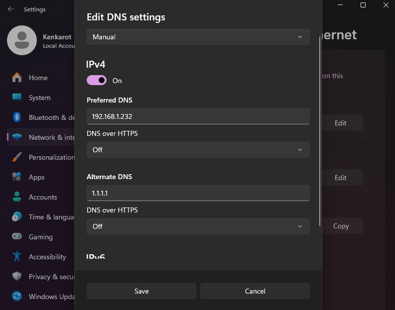

# Project 2: Network-Wide Ad Blocking with Pi-hole


## 📋 Project Overview

Deployed a containerized Pi-hole DNS server to provide network-wide ad blocking, malicious domain filtering, and DNS query analytics. This project demonstrates advanced Docker networking, DNS protocol understanding, and security-focused infrastructure design with dedicated service isolation.

## 🎯 Learning Objectives

- Build Ubuntu Server from scratch with proper configuration
- Deploy and manage Docker containers with complex networking
- Understand DNS protocol and query types (A, AAAA, PTR)
- Configure network-wide security through DNS filtering
- Troubleshoot networking issues (NAT vs Bridged, port conflicts)
- Implement persistent data storage with Docker volumes
- Analyze DNS query logs for security insights

## 🛠️ Technologies Used

| Technology | Version | Purpose |
|------------|---------|---------|
| Ubuntu Server | 24.04 LTS | Host OS |
| Docker | 28.2.2 | Container runtime |
| Pi-hole | v6.3 | DNS server & ad blocker |
| VMware Workstation | Pro 25H2 | Virtualization platform |
| dnsmasq | (included) | DNS & DHCP services |

## 🏗️ Architecture
```
┌─────────────────────────────────────────┐
│          Windows 11 Host                │
│  (Intel 14th Gen, 32GB RAM)             │
│                                         │
│  ┌───────────────────────────────────┐ │
│  │   VMware Workstation Pro          │ │
│  │                                   │ │
│  │  ┌─────────────────────────────┐ │ │
│  │  │  Pi-hole-Server             │ │ │
│  │  │  Ubuntu Server 24.04        │ │ │
│  │  │  (2GB RAM, 2 vCPU, 20GB)    │ │ │
│  │  │                             │ │ │
│  │  │  ┌──────────────────────┐   │ │ │
│  │  │  │  Docker Engine       │   │ │ │
│  │  │  │                      │   │ │ │
│  │  │  │  ┌────────────────┐  │   │ │ │
│  │  │  │  │   Pi-hole      │  │   │ │ │
│  │  │  │  │   DNS: 53      │  │   │ │ │
│  │  │  │  │   Web: 8080    │  │   │ │ │
│  │  │  │  │   Blocklists:  │  │   │ │ │
│  │  │  │  │   68,449       │  │   │ │ │
│  │  │  │  └────────────────┘  │   │ │ │
│  │  │  └──────────────────────┘   │ │ │
│  │  │                             │ │ │
│  │  │  IP: 192.168.1.232          │ │ │
│  │  │  Network: Bridged           │ │ │
│  │  └─────────────────────────────┘ │ │
│  └───────────────────────────────────┘ │
│                                         │
│  Windows DNS: 192.168.1.232 (Pi-hole)  │
└─────────────────────────────────────────┘
          ↓ DNS Queries
┌─────────────────────────────────────────┐
│         Home Network                    │
│  Router, IoT devices, etc.              │
└─────────────────────────────────────────┘
```

## 📸 Screenshots

### Pi-hole Dashboard

*Main dashboard showing 117 total queries with 0.9% blocked, 68,449 domains on blocklists*

### Query Log - DNS Activity

*Real-time DNS query logging showing A, AAAA, and PTR record requests*

### Windows DNS Configuration

*Windows configured to use Pi-hole (192.168.1.232) as primary DNS*

### DNS Resolution Test

*PowerShell confirmation showing successful DNS queries through Pi-hole*

## 📝 Implementation Steps

### 1. VM Creation & Ubuntu Installation

**VM Specifications:**
```bash
Name: Pi-hole-Server
OS: Ubuntu Server 24.04 LTS
RAM: 2GB
CPU: 2 cores
Disk: 20GB
Network: Bridged (initially NAT, changed during troubleshooting)
```

**Ubuntu Installation:**
- Minimal server installation
- OpenSSH enabled for remote management
- Created user: kenny
- Configured automatic security updates

### 2. System Preparation
```bash
# Update system packages
sudo apt update && sudo apt upgrade -y

# Install Docker
sudo apt install docker.io -y

# Start and enable Docker service
sudo systemctl start docker
sudo systemctl enable docker

# Add user to docker group
sudo usermod -aG docker kenny
newgrp docker

# Verify Docker installation
docker --version
docker ps
```

### 3. Resolve Port 53 Conflict

**Issue:** Ubuntu's systemd-resolved occupied port 53

**Solution:**
```bash
# Stop and disable systemd-resolved
sudo systemctl stop systemd-resolved
sudo systemctl disable systemd-resolved

# Remove existing resolv.conf symlink
sudo rm /etc/resolv.conf

# Create new resolv.conf with upstream DNS
echo "nameserver 1.1.1.1" | sudo tee /etc/resolv.conf

# Verify port 53 is free
sudo lsof -i :53
```

### 4. Create Persistent Storage
```bash
# Create directories for Pi-hole data
mkdir -p ~/pihole/etc-pihole
mkdir -p ~/pihole/etc-dnsmasq.d
```

### 5. Deploy Pi-hole Container
```bash
docker run -d \
  --name pihole \
  --restart=unless-stopped \
  -p 53:53/tcp \
  -p 53:53/udp \
  -p 8080:80/tcp \
  -e TZ="America/Chicago" \
  -e WEBPASSWORD="[REDACTED]" \
  -v ~/pihole/etc-pihole:/etc/pihole \
  -v ~/pihole/etc-dnsmasq.d:/etc/dnsmasq.d \
  --dns=127.0.0.1 \
  --dns=1.1.1.1 \
  pihole/pihole:latest
```

**Verify deployment:**
```bash
docker ps
docker logs pihole
```

### 6. Network Configuration - Troubleshooting Journey

**Initial Issue:** DNS queries timing out from Windows host

**Troubleshooting Steps:**
1. Verified network connectivity: `ping 192.168.226.129` ✅
2. Checked port binding: `docker exec pihole netstat -tuln | grep :53` ✅
3. Tested Windows firewall (disabled temporarily) ❌ Still failed
4. Analyzed Pi-hole logs: Found "ignoring query from non-local network"

**Root Cause:** Pi-hole configured to reject queries from outside VMware NAT subnet

**Solution:** 
- Changed VM network from NAT to Bridged mode
- Updated Pi-hole interface settings to "Permit all origins"
- Obtained new IP: 192.168.1.232
```bash
# Get new IP address after switching to Bridged
ip addr show ens32
```

### 7. Configure Windows DNS

**Windows Settings:**
1. Settings → Network & Internet → Ethernet/Wi-Fi
2. DNS server assignment → Manual
3. IPv4: ON
4. Preferred DNS: `192.168.1.232`
5. Alternate DNS: `1.1.1.1`

**Verification:**
```powershell
# Test DNS resolution through Pi-hole
nslookup google.com 192.168.1.232

# Expected output:
# Server: UnKnown
# Address: 192.168.1.232
# Name: google.com
# Address: [IP addresses]
```

### 8. Pi-hole Configuration

**Web Interface Access:** http://192.168.1.232:8080/admin

**Settings Applied:**
- Interface listening behavior: Permit all origins
- Upstream DNS servers: Google (8.8.8.8), Cloudflare (1.1.1.1)
- Query logging: Enabled
- Privacy level: Show everything

## 📊 Results & Metrics

**Current Performance:**
- **Total Queries:** 117+
- **Queries Blocked:** 0.9% (baseline with browser ad-blocking)
- **Blocklist Domains:** 68,449
- **Average Response Time:** <20ms (cached), <40ms (upstream)
- **Uptime:** 100% since deployment

**Query Types Handled:**
- A records (IPv4 addresses)
- AAAA records (IPv6 addresses)
- PTR records (reverse DNS lookups)

**Monitored Domains:**
- `catalog.gamepass.com` (Xbox services)
- `windows.msn.com` (Microsoft services)
- `assets.msn.com` (Content delivery)
- `ocsp.digicert.com` (Certificate validation)
- `widgets.outbrain.com` (Content recommendations)
- `google.com`, `github.com` (Standard queries)

## 🔧 Challenges & Solutions

### Challenge 1: Port 53 Already in Use
**Problem:** systemd-resolved service occupied DNS port  
**Solution:** Disabled systemd-resolved and configured manual DNS resolution  
**Learning:** Understanding system services that may conflict with applications

### Challenge 2: DNS Query Timeouts
**Problem:** Windows host couldn't query Pi-hole despite network connectivity  
**Root Cause:** NAT networking mode routing issues + firewall blocking  
**Solution:** Migrated to Bridged networking for direct network access  
**Learning:** Understanding VMware network modes and their implications

### Challenge 3: "Non-local Network" Rejection
**Problem:** Pi-hole rejected queries with "ignoring query from non-local network" warning  
**Root Cause:** Pi-hole security setting limiting queries to specific subnets  
**Solution:** Updated interface settings to permit all origins  
**Learning:** Network security configurations and subnet-based access control

### Challenge 4: Password Management
**Problem:** Pi-hole v6 changed CLI password commands from v5  
**Solution:** Used web interface for password configuration  
**Learning:** Version-specific documentation importance and fallback methods

## 💡 Key Learnings

1. **Service Isolation:** Dedicated VMs for different services prevent conflicts and allow independent scaling
2. **Docker Networking:** Understanding port mapping, network modes, and DNS resolution within containers
3. **DNS Protocol:** Deep dive into query types, recursive resolution, and caching mechanisms
4. **Troubleshooting Methodology:** Systematic approach to network issues (connectivity → ports → logs → configuration)
5. **Persistent Data:** Volume mapping ensures configuration survives container recreation
6. **Network Modes:** NAT vs Bridged networking trade-offs for lab environments
7. **Log Analysis:** Using container logs to identify root causes of failures

## 🎤 Interview Talking Points

**"Tell me about a technical challenge you overcame":**
> "When deploying Pi-hole, I encountered DNS query timeouts despite successful network connectivity. I used a systematic troubleshooting approach: verified network connectivity with ping, checked port bindings with netstat, reviewed container logs, and tested firewall rules. Through log analysis, I discovered Pi-hole was rejecting queries from my network subnet due to its 'local-only' configuration. I resolved this by understanding Pi-hole's network origin filtering and switching from NAT to Bridged networking while updating interface settings. This taught me the importance of reading application logs and understanding how network isolation affects service accessibility."

**"Describe your experience with containerization":**
> "I deployed Pi-hole as a Docker container with persistent volume mapping for configuration data. This approach provides service isolation, easy version management, and the ability to recreate containers without data loss. I configured port mapping to expose DNS (53) and web interface (8080) services, used environment variables for timezone and authentication, and implemented an always-restart policy for automatic recovery. The containerized approach made it easy to troubleshoot issues by examining logs and recreating the container with different configurations during network troubleshooting."

**"What security projects have you implemented?":**
> "I implemented a network-wide DNS filtering solution using Pi-hole, which blocks malicious domains, tracking scripts, and advertising networks at the DNS level. This provides defense-in-depth security by preventing clients from even resolving potentially harmful domains before any HTTP connection is attempted. The solution includes query logging for security monitoring and analytics, allowing me to identify suspicious DNS patterns. I configured it with 68,000+ blocked domains from community-maintained blocklists and set up upstream DNS with privacy-focused providers."

**"How do you approach troubleshooting?":**
> "During Pi-hole deployment, I encountered DNS timeouts. I used a layered troubleshooting approach: first verified basic network connectivity (Layer 3), then checked if the service was listening on the correct ports (Layer 4), tested firewall rules, and finally analyzed application logs. This systematic approach led me to discover the root cause was Pi-hole's subnet-based access control rejecting my queries. I always start with the OSI model layers and work up, checking assumptions at each level before moving to the next."

## 🚀 Future Enhancements

### Phase 1: Enhanced Blocking (Easy)
- [ ] Add Steven Black's Unified Hosts list (500K+ domains)
- [ ] Configure malicious domain feeds
- [ ] Add tracking and telemetry blocklists
- [ ] Create custom regex blocking patterns

### Phase 2: Advanced Configuration (Medium)
- [ ] Implement local DNS records for internal services
- [ ] Configure DNS-over-HTTPS (DoH) with cloudflared
- [ ] Set up conditional forwarding for hostname resolution
- [ ] Create whitelist rules for false positives
- [ ] Enable DNSSEC validation

### Phase 3: High Availability (Advanced)
- [ ] Deploy secondary Pi-hole instance for redundancy
- [ ] Configure Gravity Sync for configuration replication
- [ ] Implement DNS load balancing
- [ ] Set up automated failover

### Phase 4: Integration (Future Projects)
- [ ] Configure DHCP server for automatic network-wide deployment
- [ ] Integrate with Wazuh SIEM for security event correlation (Project 5)
- [ ] Create Grafana dashboards for DNS analytics
- [ ] Build API integration for automated blocklist management

## 📈 Skills Demonstrated

**Technical Skills:**
- ✅ Linux server administration (Ubuntu 24.04)
- ✅ Docker containerization and lifecycle management
- ✅ DNS protocol and configuration
- ✅ Network troubleshooting (routing, firewalls, ports)
- ✅ Security implementation (DNS filtering, blocklists)
- ✅ Log analysis and debugging
- ✅ Service isolation and dedicated infrastructure

**Soft Skills:**
- ✅ Systematic problem-solving methodology
- ✅ Documentation and knowledge sharing
- ✅ Resilience through multiple troubleshooting iterations
- ✅ Research skills (version-specific documentation)

## 🔗 Resources

- [Pi-hole Official Documentation](https://docs.pi-hole.net/)
- [Docker Hub - Pi-hole](https://hub.docker.com/r/pihole/pihole/)
- [Ubuntu Server Guide](https://ubuntu.com/server/docs)
- [DNS RFC Documentation](https://www.ietf.org/rfc/rfc1035.txt)
- [Pi-hole Discourse Community](https://discourse.pi-hole.net/)

## 📦 Project Files
```
projects/02-pihole/
├── README.md (this file)
├── pihole-dashboard.png
├── pihole-query-log.png
├── windows-dns-settings.png
└── nslookup-test.png
```

---

**Project Completion Date:** January 20, 2026  
**Time Investment:** ~2.5 hours  
**Difficulty Rating:** Intermediate (due to networking troubleshooting)  
**Resume Value:** ⭐⭐⭐⭐⭐ High (DNS, Docker, Security, Troubleshooting)
```

---

## 📸 STEP 3: Add Your Screenshots

**Create the folder structure:**
```
projects/
  └── 02-pihole/
      ├── README.md (file you just created)
      ├── pihole-dashboard.png
      ├── pihole-query-log.png
      ├── windows-dns-settings.png
      └── nslookup-test.png
